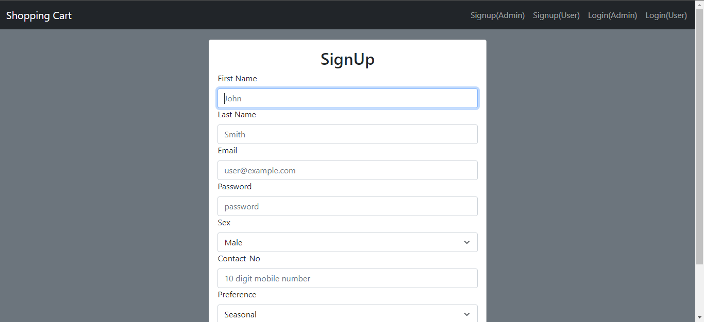
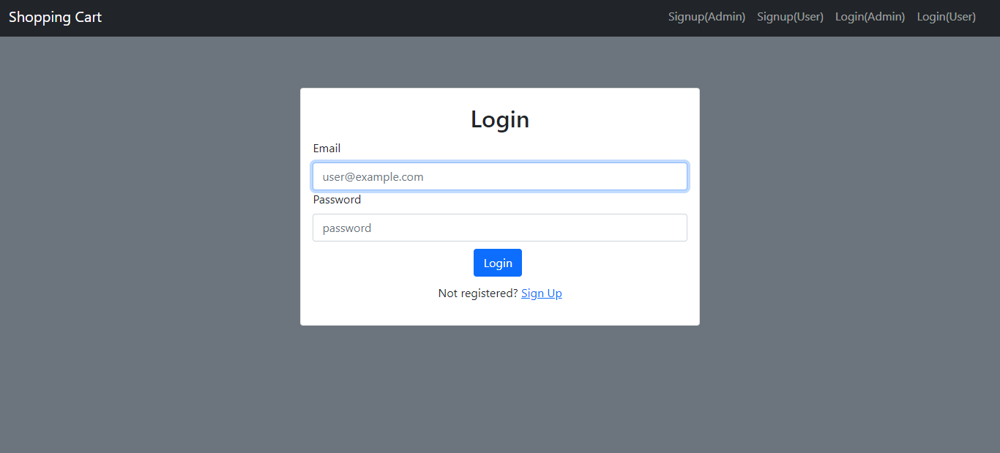
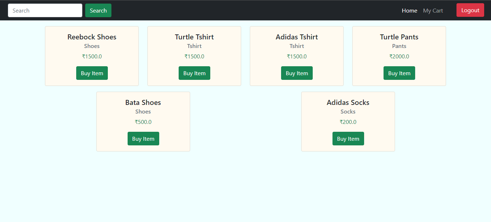
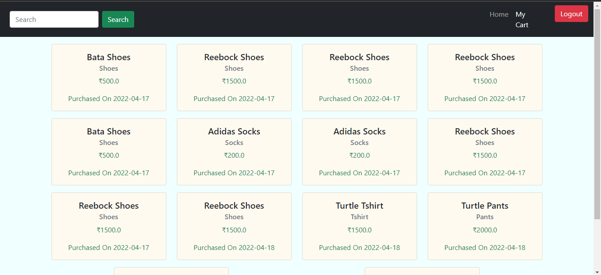
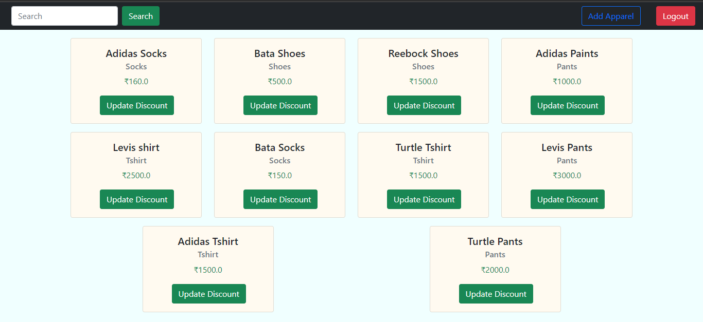

# ShoppingCart
A shopping website from where users can buy apparels based on their preferences(Seasonal/New Arrival). There are separate register and login pages for user and admin.
Admins have the power to add an item or update discount of an item(for a certain interval). Both Admins and Users can search for the item they are looking for, in the search bar.
The application is developed using SpringBoot and h2 is used as database.

# UI of the Application
### Home Page
</img>

### SignUp(Admin and Users have separate register pages)
</img>

### SignIn(Admin and Users have separate login pages)
</img>

### Home Page for user after successful login
</img>

### Shopping Cart for user
</img>

### Search tab for user
</img>

### Home Page for Admin after successful login
</img>

### Giving discount of 20% on Adidas Socks
</img>

### After applying discount
</img>

### Adding Apparel
</img>
